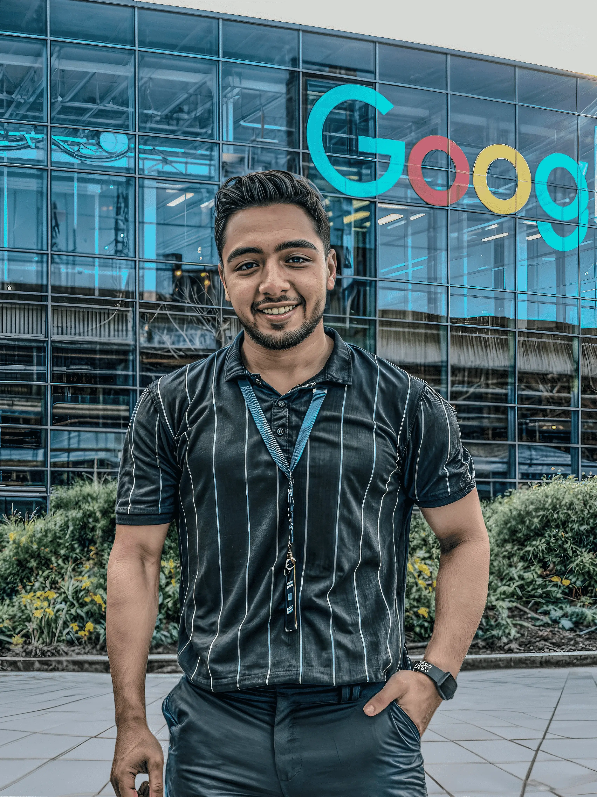

 

  <h1 align="center" style="margin-top:35">
    
</h1>

# 👨‍💻 About Me:

### I'm a junior frontend developer with a passion for crafting immersive user experiences that leave people in awe. With over 1 years of industry experience, I have mastered the art of translating design concepts into pixel-perfect, blazing-fast web applications. My expertise spans across a wide range of cutting-edge technologies, I'm specialize in ReactJs & NextJs

 

# 🛠 Skills & Technologies:

  

 

      

   
     
  
  
  
  
  
      
  
  
  

# 🚀 What sets me apart?:

### Beyond my technical prowess, I have a unique ability to bridge the gap between design and development. I possess an innate sense of aesthetics and a deep understanding of user behaviors, allowing me to create visually stunning interfaces that are intuitive and delightful to use. I believe that a great user experience is the key to a successful product, and I strive to bring that magic to every project I touch.

# 💡 Problem-Solving Philosophy:

### Think of me as a frontend detective, equipped with a keen eye for detail and a determination to solve even the most perplexing coding mysteries. I thrive on dissecting complex challenges, breaking them down into manageable pieces, and methodically crafting elegant solutions. And when I finally crack the code, the feeling of accomplishment is nothing short of exhilarating!

# ✨ Bringing Fun to the Table:

### Who says work can't be fun? Not me! I believe that a positive and enjoyable work environment leads to the most extraordinary results. I'm that developer who brings a smile to the team, cracking a joke or two while conquering complex challenges. While I take my work seriously, I never underestimate the power of laughter and camaraderie. So, get ready for a mix of productivity, creativity, and a whole lot of fun when you have me on your team!

# 🌐 Lifelong Learning and Innovation:

### The world of frontend development is a constantly evolving landscape, and I thrive on staying at the forefront of innovation. I'm an avid learner, always seeking new technologies, frameworks, and design trends to push the boundaries of what's possible. Whether it's attending conferences, participating in coding challenges, or contributing to open-source projects, I'm committed to personal growth and embracing the ever-changing tech ecosystem.

# 🤝 Let's Create Something:

### If you're a hiring manager seeking an unstoppable frontend force to join your team, look no further! I'm ready to bring my skills, creativity, and relentless drive to your organization. Let's collaborate and build awe-inspiring digital experiences that leave a lasting impact, so let's make magic happen!

### Thank you for taking the time to get to know the powerhouse that is Mahmoud Saeed. Together, we'll defy expectations, break barriers, and create a future where extraordinary frontend development is the norm. Buckle up, because we're about to embark on an incredible journey to success!

## Watch my contributions get eaten by snake 🐍

<picture>
  <source
    media="(prefers-color-scheme: dark)"
    srcset="https://raw.githubusercontent.com/platane/snk/output/github-contribution-grid-snake-dark.svg"
  />
  <source
    media="(prefers-color-scheme: dark)"
    srcset="https://raw.githubusercontent.com/platane/snk/output/github-contribution-grid-snake.svg"
  />
  
</picture>
